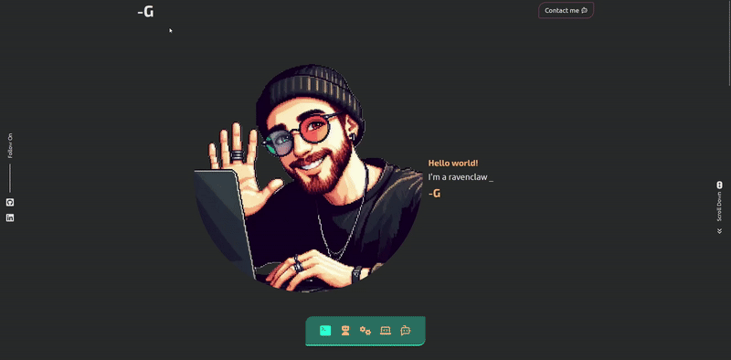

# ✨ Personal Portfolio & Website ✨

Welcome to my personal portfolio website! This is where you can explore my web development journey, skills, and projects. Designed to showcase my work in a sleek, modern, and interactive way. Built with Next.js, SCSS, and a focus on user experience, this site will grow as I continue to add more projects and features.

## 🎬 Project Showcase 🎥

Here’s a quick demo of my project in action:




## 🚀 Technologies Used

- **Next.js** – React framework for server-side rendering and static site generation.
- **SCSS** – Powerful CSS preprocessor for clean and maintainable styling.
- **React Icons** – For stylish icons that complement the design.
- **Node.js** – Backend and API integration (if needed).
- **Other tools and dependencies** – To bring everything together smoothly!

## 🌟 Features

- **Responsive Design** – Looks great on all devices.
- **Sleek Animations** – Subtle animations to enhance the user experience.
- **Interactive Contact Form** – A contact form with form validation and smooth submission.
- **Project Showcase** – Explore my coding projects, skills, and achievements.
- **GitHub Integration** – A link to my GitHub profile for easy access to my open-source contributions.

## 🛠️ Environment Variables Setup

Make sure to set the following environment variables in your `.env.local` file to configure the necessary services:

- **NEXT_PUBLIC_EMAILJS_SERVICE_ID** ✉️: The service ID for EmailJS to send emails.
- **NEXT_PUBLIC_EMAILJS_TEMPLATE_ID** 📝: The template ID for the email you want to send via EmailJS.
- **NEXT_PUBLIC_EMAILJS_PUBLIC_ID** 🔑: The public key provided by EmailJS to authenticate API requests.
- **NEXT_PUBLIC_USERNAME** 👤: Your username for personal or app-related usage.
- **NEXT_PUBLIC_GITHUB_LINK** 🖥️: Link to your GitHub profile or repository.
- **NEXT_PUBLIC_LINKEDIN_LINK** 💼: Link to your LinkedIn profile for networking.

## 🛠️ Installation Instructions

To get started, clone this repository and install the dependencies:

```bash
git clone 
cd personal-site
npm install
npm run dev
```

This will install all the necessary packages and start the local development server at `http://localhost:3000`.

## 🌐 Live Demo

Check out my live site at [https://www.dashg.dev/](https://www.dashg.dev).

## 🙏 Acknowledgments

Big thanks to the developers and creators of the libraries I use, and to the open-source community for their amazing tools!
